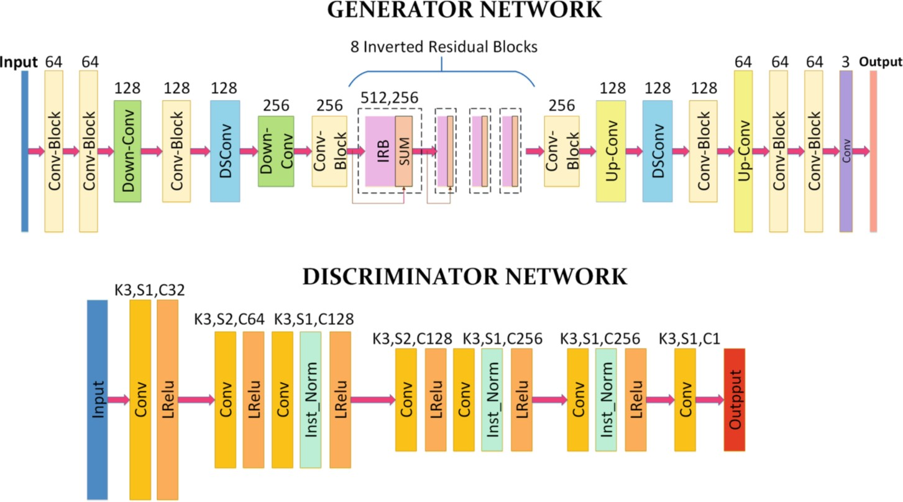
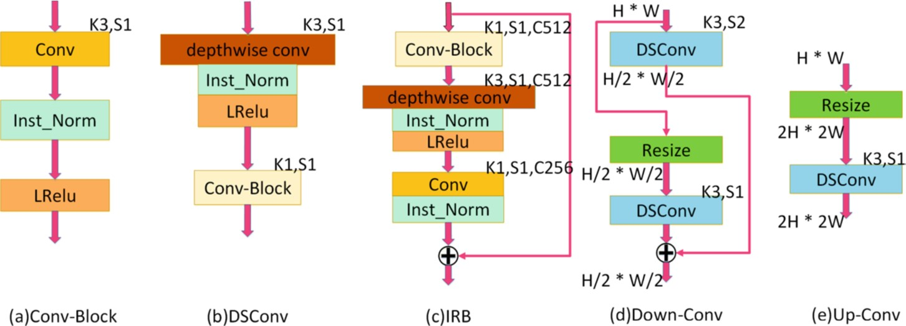

# AnimeGeneration

In this project, we tackle the problem of generating anime-like images from real-life photos. 
We build off existing papers such as [AnimeGAN](https://github.com/TachibanaYoshino/AnimeGAN) and 
[CartoonGAN](https://openaccess.thecvf.com/content_cvpr_2018/papers/Chen_CartoonGAN_Generative_Adversarial_CVPR_2018_paper.pdf),
and we present a pytorch implementation of a similar generative adversarial network (GAN). 
In our project, we show through our results that our GAN can learn to manipulate input images 
and slightly edit the stylization, but fails to replicate the the exact cartoonization of
AnimeGAN and CartoonGAN.  

VIDEO GOES HERE (probably): Record a 2-3 minute long video presenting your work. One option - take all your figures/example images/charts that you made for your website and put them in a slide deck, then record the video over zoom or some other recording platform (screen record using Quicktime on Mac OS works well). The video doesn't have to be particularly well produced or anything.

## Introduction

Anime is prevalant all over the world and plays a large role in modern day culture. Famous animes include movies such as My Neighbor Totoro, Spirited Away, Your Name as well as shows like Naruto, My Hero Academia, and Demon Slayer. These movies and shows are widely popular among people of all generations, especially the younger population. Having watched many animes and being fascinated with the graphic animations and aesthetic artwork, we always wondered how much work was put in behind the scenes. Drawing the frames in particular seems challenging and time consuming, so we thought it would be interesting to see if we could take real-life photos and convert them to anime-like images. This would save a lot of time for animators, and instead of animating from scratch, they could take these generated anime images and simply touch them up. This would especially be useful if the scenery is inspired by real-life locations, such as the movie Your Name being based off real places in Japan. This could also be a useful tool for people who want to play around and create animes but don't have the artistic ability to do so.

To solve this problem, we trained a generative adversarial network (GAN) to generate an anime-like image given a real-life photo. The network trains on a set of photos consisting of real-life photos as well as anime images. There are a variety of different anime styles, such as Hayao, Shinkai, and Paprika, but we focused solely on the Shinkai style. In the generator, we used a combination of four different losses in order to optimize for the distinct anime-style, which consists of clear edges and smooth colored texture. These losses are content loss to retain the content of the input photo, grayscale style loss to focus on edges and texture, color reconstruction loss to retain the colors of the original image, and lastly, adversarial loss to produce high quality images and make the network training more stable. In the discriminator, we have a grayscale adversarial loss to promote vivid colors from the generator as well as an edge-promoting adversarial loss to preserve clear edges. Using these techniques, we train a GAN that strives to transform real-life photos into anime images.

## Related Work

Much research has been done on non-realistic rendering of real-life photos. Researchers have 
developed several different ways to translate an input image, including neural-style transfer 
and generative adversarial networks. 

Neural-Style Transfer (NST) is a technique developed by Gatys et. al in their paper "Image 
Style Transfer Using Convolutional Neural Networks." Their technique takes in two input 
images, a content image and a style image, and transfers the "style" of the style image onto 
the other image. In order to do so, both images are passed through a perceptual network, 
which extracts important features from both images. A randomly generated image is then 
compared based how similar its features are to the extracted features. From this, NST will 
continue to alter the generated image until the generated images and both input images are 
sufficiently similar. However, the NST technique cannot easily capture the vistual style of 
anime. For example, consider the task of translating a human face to an anime character's 
face. NST cannot work well for this task because it fails to capture distinct Anime-like
features, such as large eyes, sharp jaws, and non-existent noses. In short, NST cannot 
transform objects in the input image to something else.

An alternative approach to the NST technique is image generation using Generative Adversarial
Networks (GANs). GANs are a class of neural networks that consist of two competing neural 
networks, the generator and the discriminator. The generator attempts to generate counterfeit 
images that closely resemble images from a target distribution, while the discriminator tries 
to distinguish between proper and counterfeit images. As an example, you can imagine the 
generator being a counterfeiter producing fake money, while the discriminator is a police 
officer trying to tell the difference between real and fake money. 

Within GAN literature, there are two main works that are most closely related to our goal of 
applying anime-like style to input images. First, CartoonGAN shows how GANs can be 
effectively apply cartoonization of real life photos. Second, AnimeGAN presents a more 
lightweight alternative to CartoonGAN with dedicated loss functions for the same 
cartoonization task. As a comparison, we use similar architectures and loss functions as 
CartoonGAN and AnimeGAN, but we explore several simplications of the problem, such as using 
an autoencoder-like architecture instead of a GAN architecture. 

However, our project most differs in how we present our work. GANs are notoriously difficult
networks to train, yet both papers provide a total of one paragraph on their training regime 
and how they designed it. Here, we try to detail a more comprehensive and specific set of
instructions on how to train our GAN and elaborate on how we implement our training regime.
Furthermore, we discuss ideas for how we can improve GAN training and point out different
ways our project can be improved.

## Approach

How did you decide to solve the problem? What network architecture did you use? What data? Lots of details here about all the things you did. This section describes almost your whole project.
Our project was heavily based off of [AnimeGAN](https://github.com/TachibanaYoshino/AnimeGAN), which is currently the state-of-the-art anime/cartoon generator (they recently released an AnimeGANv2, but did not have extensive documentation on it). We wished to reproduce their high quality results, so our implementation follows theirs for the most part. Our model is a GAN and thus consists of two convolutional neural networks: a generator to transform real-life photos to anime-like images and a discriminator to determine whether the images are real anime images or if they were produced by the generator. The architecture of these two neural networks in AnimeGAN is as follows:

The generator consists of small modules, such as convolution blocks (Conv-Block), depthwise separable convolutions (DSConv), inverted residual blocks (IRB), upsampling (Up-Conv), and downsampling (Down-Conv). The architecture of these modules can be found below:

Throughout the process, we experimented with a variety of 

### Initial Implementation
In our initial implementation, we followed the AnimeGAN architecture as closely as possible. One thing we did change was downsize the generator network by only using 4 inverted residual blocks instead of 8 due to our limited computing power and time. 

### Discriminator Changes: dropout layers and train discriminator

### Experimenting without discriminator

### Neural Style Transfer

### Decreasing image size

Figures are good here. Maybe you present your network architecture or show some example data points?

Simgoid activation after generator? 

## Results

How did you evaluate your approach? How well did you do? What are you comparing to? Maybe you want ablation studies or comparisons of different methods.

You may want some qualitative results and quantitative results. Example images/text/whatever are good. Charts are also good. Maybe loss curves or AUC charts. Whatever makes sense for your evaluation.

## Discussion

You can talk about your results and the stuff you've learned here if you want. Or discuss other things. Really whatever you want, it's your project.

## Useful Links

https://towardsdatascience.com/10-lessons-i-learned-training-generative-adversarial-networks-gans-for-a-year-c9071159628

