# AnimeGeneration
By: Andressa Chan & Mino Nakura

In this project, we tackle the problem of generating anime-like images from real-life photos. 
We build off existing papers such as [AnimeGAN](https://github.com/TachibanaYoshino/AnimeGAN) and 
[CartoonGAN](https://openaccess.thecvf.com/content_cvpr_2018/papers/Chen_CartoonGAN_Generative_Adversarial_CVPR_2018_paper.pdf),
and we present a pytorch implementation of a similar generative adversarial network (GAN). 
In our project, we show through our results that our GAN can learn to manipulate input images 
and slightly edit the stylization, but fails to replicate the the exact cartoonization of
AnimeGAN and CartoonGAN.  

### Youtube Video: [Link](https://youtu.be/I6hCozWtC7Q)

### Presentation Slides: [Link](https://docs.google.com/presentation/d/1yxDex6muIzjQaZuImfzMuVBSx_C7LuMb9QOoD2IAfY0/edit?usp=sharing)

### Demo: [Download our colab file here!](https://github.com/NakuraMino/AnimeGeneration/blob/main/demo.ipynb)

## Introduction

Anime is prevalant all over the world and plays a large role in modern day culture. Famous animes include movies such as My Neighbor Totoro, Spirited Away, Your Name as well as shows like Naruto, My Hero Academia, and Demon Slayer. These movies and shows are widely popular among people of all generations, especially the younger population. Having watched many animes and being fascinated with the graphic animations and aesthetic artwork, we always wondered how much work was put in behind the scenes. Drawing the frames in particular seems challenging and time consuming, so we thought it would be interesting to see if we could take real-life photos and convert them to anime-like images. This would save a lot of time for animators, and instead of animating from scratch, they could take these generated anime images and simply touch them up. This would especially be useful if the scenery is inspired by real-life locations, such as the movie Your Name being based off real places in Japan. This could also be a useful tool for people who want to play around and create animes but don't have the artistic ability to do so.

To solve this problem, we trained a generative adversarial network (GAN) to generate an anime-like image given a real-life photo. The network trains on a set of photos consisting of real-life photos as well as anime images. There are a variety of different anime styles, such as Hayao, Shinkai, and Paprika, but we focused solely on the Shinkai style. In the generator, we used a combination of four different losses in order to optimize for the distinct anime-style, which consists of clear edges and smooth colored texture. These losses are content loss to retain the content of the input photo, grayscale style loss to focus on edges and texture, color reconstruction loss to retain the colors of the original image, and lastly, adversarial loss to produce high quality images and make the network training more stable. In the discriminator, we have a grayscale adversarial loss to promote vivid colors from the generator as well as an edge-promoting adversarial loss to preserve clear edges. Using these techniques, we train a GAN that strives to transform real-life photos into anime images.

## Related Work

Much research has been done on non-realistic rendering of real-life photos. Researchers have 
developed several different ways to translate an input image, including neural-style transfer 
and generative adversarial networks. 

Neural-Style Transfer (NST) is a technique developed by Gatys et. al in their paper "Image 
Style Transfer Using Convolutional Neural Networks." Their technique takes in two input 
images, a content image and a style image, and transfers the "style" of the style image onto 
the other image. In order to do so, both images are passed through a perceptual network, 
which extracts important features from both images. A randomly generated image is then 
compared based how similar its features are to the extracted features. From this, NST will 
continue to alter the generated image until the generated images and both input images are 
sufficiently similar. However, the NST technique cannot easily capture the vistual style of 
anime. For example, consider the task of translating a human face to an anime character's 
face. NST cannot work well for this task because it fails to capture distinct Anime-like
features, such as large eyes, sharp jaws, and non-existent noses. In short, NST cannot 
transform objects in the input image to something else.

An alternative approach to the NST technique is image generation using Generative Adversarial
Networks (GANs). GANs are a class of neural networks that consist of two competing neural 
networks, the generator and the discriminator. The generator attempts to generate counterfeit 
images that closely resemble images from a target distribution, while the discriminator tries 
to distinguish between proper and counterfeit images. As an example, you can imagine the 
generator being a counterfeiter producing fake money, while the discriminator is a police 
officer trying to tell the difference between real and fake money. 

Within GAN literature, there are two main works that are most closely related to our goal of 
applying anime-like style to input images. First, CartoonGAN shows how GANs can be 
effectively apply cartoonization of real life photos. Second, AnimeGAN presents a more 
lightweight alternative to CartoonGAN with dedicated loss functions for the same 
cartoonization task. As a comparison, we use similar architectures and loss functions as 
CartoonGAN and AnimeGAN, but we explore several simplications of the problem, such as using 
an autoencoder-like architecture instead of a GAN architecture. 

However, our project most differs in how we present our work. GANs are notoriously difficult
networks to train, yet both papers provide a total of one paragraph on their training regime 
and how they designed it. Here, we try to detail a more comprehensive and specific set of
instructions on how to train our GAN and elaborate on how we implement our training regime.
Furthermore, we discuss ideas for how we can improve GAN training and point out different
ways our project can be improved.

## Approach

How did you decide to solve the problem? What network architecture did you use? What data? Lots of details here about all the things you did. This section describes almost your whole project.
Our project was heavily based off of [AnimeGAN](https://github.com/TachibanaYoshino/AnimeGAN), which is currently the state-of-the-art anime/cartoon generator (they recently released an AnimeGANv2, but did not have extensive documentation on it). We wished to reproduce their high quality results, so our implementation follows theirs for the most part. Our model is a GAN and thus consists of two convolutional neural networks: a generator to transform real-life photos to anime-like images and a discriminator to determine whether the images are real anime images or if they were produced by the generator. The architecture of these two neural networks in AnimeGAN is as follows:
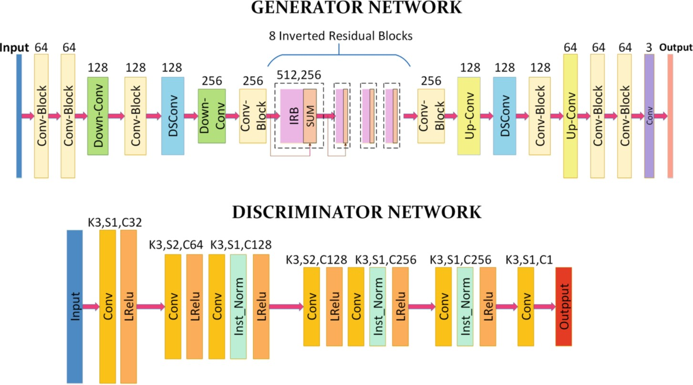

The generator consists of small modules, such as convolution blocks (Conv-Block), depthwise separable convolutions (DSConv), inverted residual blocks (IRB), upsampling (Up-Conv), and downsampling (Down-Conv). The architecture of these modules can be found below:
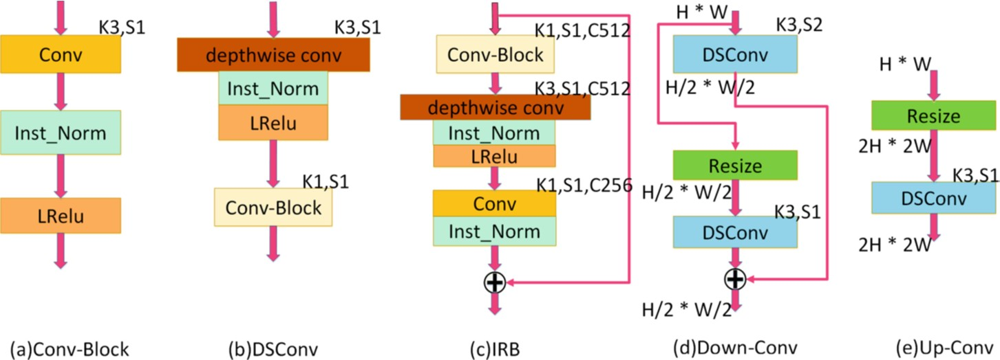

### Dataset
The dataset we used originated from AnimeGAN. It consists of 6656 real-life photos and 1650 Shinkai-style anime images from the movie Your Name (there are other anime style images, but we focused on Shinkai). Using the anime images, we created new sets of images, such as grayscale anime images, and grayscale anime images with smoothed edges. These new images were created in order for the GAN to learn that smoothed edges should not be considered anime style. The losses below describe more in depth how these images are used.

### Loss Functions
Both the generator and discriminator have loss functions that optimize the generator to produce images that are anime-like in style. The generator adopts four different losses: content loss, grayscale style loss, color reconstruction loss, and adversarial loss. To calculate some of the losses, we use a pre-trained VGG19 as a perceptual network. In particular, we use the Conv4-4 layer of VGG19 to extract high-level semantic features of the images. For simplicity, we will refer to the input real-life photo as _p_, its generated image as _G(p)_, and the output of VGG19 conv4-4 layer as _VGG()_.

The content loss aims to have the generated image retain the content of the input image. To calculate this, we take the L1 loss of _VGG(p)_ and _VGG(G(p))_.
Next, we have a grayscale style loss that focuses on transferring the texture of anime images onto the real-life photos. It is necessary to use grayscale images in order to eliminate color interference and to emphasize the edges and texture instead. To calculate the grayscale loss, we take the L1 loss of the Gram matrices of _VGG(p)_ and _VGG(G(p))_. 
To counteract the grayscale style loss and ensure that the generated images retain the colors of the original photos, we also have  color reconstuction loss. To calculate this loss, we convert the RGB images to YUV format and calculate the losses for each channel and add them up. Specifically, we use an L1 loss for the Y channel and Huber Loss for the U and V channels.
Finally, we have an adversarial loss to stabilize training of the network as well as to generate high quality images. The least squares loss funciton in LSGAN is used to calculate this loss.
We use these four losses, each one scaled by a unique weight, to calculate an overall loss for the generator.

The discriminator loss is a mean squared error loss based off the descriminator's decision on four different types of images: anime images, real-life photos, grayscale anime images, and grayscale smooth-edged anime images. The discriminator should classify only the anime images as anime and the other three types as non-anime images. The grayscale smooth-edged anime images is for an edge-promoting adversarial loss to optimize the generator to produce images with clear lines, as this is a distinct style in anime. The grayscale anime images is for a grayscale adversarial loss to prevent the generated images from being grayscale. The sum of these four losses multiplied by the adversarial weight (same weight as the generator's adversarial loss) is used as the discriminator's loss.
For detailed equations of each loss, more information can be found in the AnimeGAN paper.

Throughout the process, we experimented with a variety of different implementations, which is described in the following sections. 

### Initial Implementation
In our initial implementation, we followed the AnimeGAN architecture as closely as possible. One thing we did change was downsize the generator network by only using 4 inverted residual blocks instead of 8 due to our limited computing power and time. All other aspects of the implementation were consistent with AnimeGAN. The training regime in the AnimeGAN paper was very vague, so we used our knowledge about GANs to create a training process that seemed reasonable. This consisted of first pre-training our generator for 10 epochs on only the content loss so that the GAN would converge faster. After pre-training, we went on to train both the generator in a 5:1 ratio per epoch, meaning we trained the generator 5 times per epoch and discriminator only once. We chose to do so in order to avoid vanishing gradients, since the discriminator might learn its task of fake and true anime photos very early on. After training the network for a few epochs, we noticed that the images produced did not resemble the original input photo at all and were blob-like in nature. Since we weren't sure if our network would be able to learn anything with our current architecture and losses, we decided to make changes to our network which is described in the next few sections.

### Discriminator Changes
According to the AnimeGAN paper, the discriminator was trained only using MSELoss, where anime-like photos had label=1, real-life
photos had label=0, grayscaled, smooth anime photos had a label=0, and grayscaled anime photos had a label=0. However, we could
not replicate the results of AnimeGAN using this discriminator loss function. We hypothesize several a couple of reasons for this: 

1. Our discriminator is converging quickly and may be trained too frequently in comparison to the generator, resulting in
vanishing gradients. 
2. We rely too much on a small dataset. The AnimeGAN paper uses merely 1650 anime images and 6656 real-life photos. We suspect
that this is an incredibly tiny amount of data to train our network on, and our network will not be able to learn well or
generalize well. 

An obvious solution to combat (1) would be to simply decrease the number of times our discriminator is trained in contrast to the
generator. However, this is an unrealistic solution, as we do not have the computational resources nor the time to train our
network for such a long time. Thus, we decided to artifically hinder the discriminator training process by introducing dropout 
layers into our discriminator. This gives us the added benefit of forcefully shrinking our discriminator to become smaller, and 
also ensures that the discriminator is less likely to overfit, even on a small dataset. 

In order to solve (2), we decided to include another loss for the discriminator loss that was not introduced in the AnimeGAN 
paper. Specifically, we hypothesized that our discriminator cannot draw a proper boundary between real-life images and anime 
images because our dataset is too small. During our training regime, we saw that our GAN would learn to classify between anime 
images and real-life images fairly well after 6 or 7 epochs.
However, the discriminator does not draw a complete boundary between an anime photo and a real-life photo. This allows the generator to fool 
the discriminator by simplying producing altered photos of real-life photos that do not properly generate anime images. Therefore, 
to combat this issue, we have our discriminator infrequently learn to discriminate against generated photos. Specifically, we take 
the MSELoss(generator(images), 0) during the earlier stages of training, which helps the generator from producing images that do 
not look anime-like.

### Experimenting without discriminator
GANs are extremely difficult to train. Through our experiments, we also saw that our GAN was not stable and did not generate ideal 
anime-like outputs. Thus, to circumvent this problem, we experimented with various other architectures that may be able to 
generate anime-like images. More specifically, we decided to repurpose our generator as an autoencoder-like architecture. By 
removing the discriminator, we hoped to treat the autoencoder as a network that would map an image to a lower dimensional feature 
vector, and then translate the feature vector into an anime-like image. 

Our autoencoder architecture uses pretrained VGG19 convolutional layers as the encoder network. For the decoder network, we use 
five convolutional layers, each followed by an upsampling block. However, our experiments were not very successful.  We believe this 
may be because there is no adversarial loss to help the generator learn to produce specific anime-like content, we simply end up with 
images that mostly resemble the input image with differences in texture. This is similar to the failures we see in the Neural Style 
Transfer generations. Similarly, we believe the autoencoder may have been limited in terms of how small the bottleneck layer was. 
Since our encoder encodes our input into 512x8x8 feature maps, our encoder may have reduced the the image without sufficient space to 
encode all necessary features.

### Neural Style Transfer
For our project, we decided to establish a baseline using vanilla neural style transfer techniques. In particular, 
we trained an input image with an image of UW (content) and an anime background image (style) taken from the internet. Using 
these images, we set a criteria to compare against our GAN's outputs.

| Content Image | Style Image | Result |
| - | - | - |
| 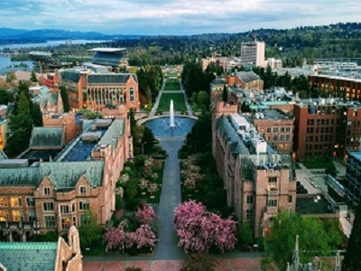 | 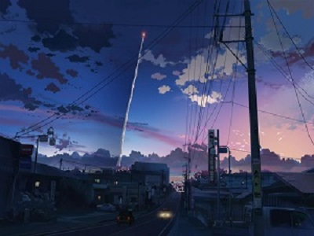 | 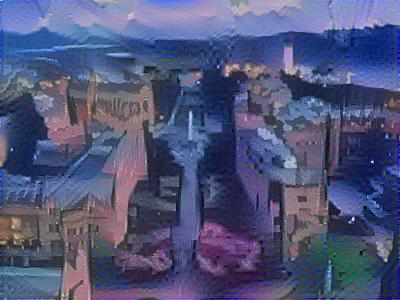 |

### Decreasing image size
Another approach we took to simplify the GAN training regime was to reduce our input size to be 64x64x3 images, instead of the 
original 256x256x3 images. We thought that by reducing the input and output size, the GAN would have a simpler time learning how 
to reproduce smaller outputs. However, after resizing our images, we saw that they were too pixelated and that the resized images 
did not properly represent anime-like images.

## Results
For our results, we present three separate types of images from three differently trained networks. First, we
have anime image generation from neural style transfer. Second, we have outputs from training our final GAN implementation.
Lastly, we present an autoencoder that stylizes our input photos and produces anime-like photos.

### Neural Style Transfer

| Content Image | Style Image | Result |
| - | - | - |
|  | 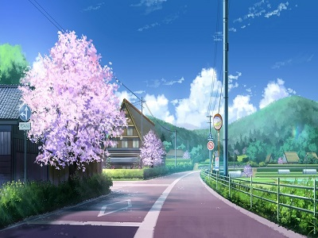 | 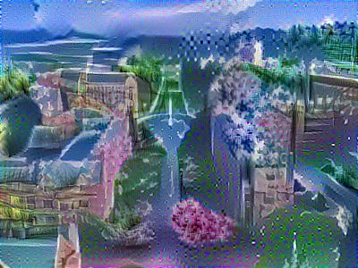 |

### GANs

| Epoch 1 | Epoch 2 | Epoch 3 | Epoch 4 |
| :-: | :-: | :-: | :-: |
| 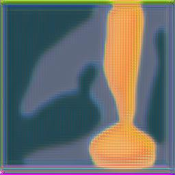 | 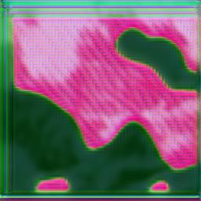 | 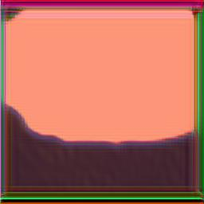 | 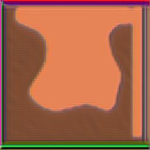 |
| Epoch 5 | Epoch 6 | Epoch 7 | Epoch 8 |
| 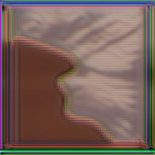 | 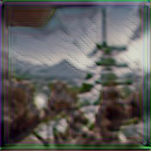 | 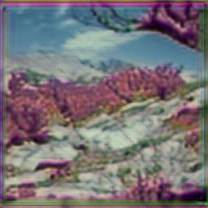 | 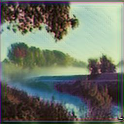 |

Training our GAN was extremely difficult and unstable, and we encountered common issues such as mode collapse. When passed in two different input images into our generator, it produced the same output images shown below:

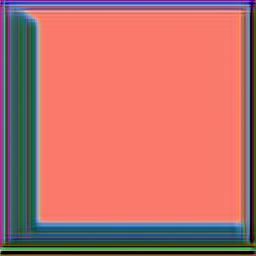

### Autoencoder

| Input Image | Result |
| - | - |
| 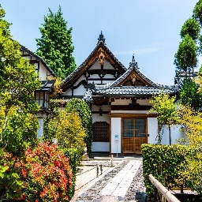 | 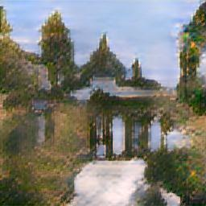 |

### Evaluation
Each type of model did not produce fully anime-style images. The neural style transfer result resembled the content and style images morphed together, and the content image features were warped. On the other hand, the GAN maintained the content of the image and looks somewhat painted, but it had some segmented portions, as seen by the pink hues in epoch 8. Finally, the autoencoder generated image highly resembles watercolor, with a pixelated/blurred look and muted colors. None of our approaches were able to successfully generate images that resembled anime. We did think that the autoencoder did a fairly good job with colors compared to the NST and GAN because the NST did not retain the original content image's colors (the colors were from the style image), and the GAN produced random pink segmentation masks. 

To evaluate our results, we viewed the transformed images and used our prior knowledge about anime to determine whether the real-life image was successfully converted into anime style. In our opinion, the produced images did not resemble anime. As another form of metric, we asked other people if they thought the photo resembled anime and were met with unanimous disapprovals (they did say it looked cool though!). Compared to the state-of-the-art AnimeGAN and CartoonGAN, we were unable to replicate their results and high quality anime styled outputs. These incomplete results are discussed in the next section.

## Discussion / Learnings

Here, we will try to discuss why our GAN could not fully replicate the results of AnimeGAN and CartoonGAN, and also 
detail the various learnings we have made over the course of this project. 

We came across various difficulties when training our GAN network. Crucially, we did not have the ability to reliably train 
our GAN, as Google Colab would frequeuntly time out. Thus, our training schedule suffered, and we would often have to rerun
parts of our training regime. Furthermore, we saw several instances when our GAN would fail due to mode collapse. In addition, 
we also ran into the problem of vanishing gradients because our discriminator will learn to predict the correct output label 
fairly quickly. We also believe our GAN trained poorly because our dataset is fairly small. 

Through this project, we brainstormed a variety of different alternatives that we believe may work, given that we have more time. 
One option would be to implement a U-net-like structure for our generator. This would provide the added benefit of allow the
generator to optimize the content loss more quickly, and allows the output to retain the general structure of the input image. 
We also believe this may be a promising direction because U-net is able to work well on small datasets, which is a problem we 
are currently facing. 

Another option would be to implement an autoencoder without using the adversarial loss. The adversary in the GAN training 
makes it extremely hard to stablize training. We saw our loss graphs fluctuate wildly due to our discriminator learning different 
boundaries for what it considers anime-like photos and what it does not consider anime-like photos. 

One last idea we have is to pretrain the generator on the existing anime photos first. The GAN papers we read pretrain on the input 
photos to stablize training, but it would be interesting to see if using anime photos in the pretraining process is promising as well. 
Specifically, we hope that this will allow for the decoder portion of the network to learn to decode the latent vectors more easily.

Through this exercise, we also gained a wide variety of knowledge and intuition we can apply to future projects. One 
important finding we learned was that our GAN would train poorly if our unweighted loss values were not in similar range 
of values. Specifically, our implemented Grayscale Style Loss started off with a value that was around 10,000 times greater 
than the values of our other losses. Since this would force the GAN to heavily optimize the Grayscale Style Loss a lot more 
heavily than our other losses, we scaled down our loss by dividing by a constant, which allowed us to tune the hyperparameters
more easily and use a smaller range of values to train our GAN on. Another learning we made was that our GANs would train more 
stably if we standardize our images to be within the values 0 and 1, since trainig a GAN to produce RGB values would be highly
unstable and would be more difficult to train. 

A third learning we gained from this project is to set up as much observing infrastructure as possible while training. It is 
very frustrating to try and train a GAN or a neural network without any visual feedback on how well our GAN is doing. Therefore, 
we found it very helpful to create utility functions that would help reconstruct the outputted images and give us feedback on 
how our training was working.

Overall, through this project, we learned a lot about GANs, their instability, and the difficulty of replicating papers. Coding everything mostly from scratch is very error prone, and we found multiple bugs in our implementation throughout the process. This was quite frustrating, as the discovery of a bug would mean hours of training gone to waste. Additionally, since the paper's implementation details were quite vague, we were left unsure whether our training regime and loss calculations were viable and correct. Coming in, we thought we could use the parameters the paper provided, such as the learning rates, weights for each losses (since we had four types of losses), etc. However, after realizing that our implementation might differ from theirs, we had to experiment with our own parameters and tune them based on our outputs. Another difficulty was the lack of computing resources and time we had. AnimeGAN and CartoonGAN both trained their network for 200 epochs in order to produce a model that produced high quality anime images. Since an epoch took sometimes hours for us, we had to quickly make decisions about our model's performance based off only a few epochs and decide whether to continue training or to change our architecture or parameters. Until now, it is difficult to say whether our model's subpar generated images stems from implementation or from lack of training.

## Useful Links
https://github.com/TachibanaYoshino/AnimeGAN

https://towardsdatascience.com/10-lessons-i-learned-training-generative-adversarial-networks-gans-for-a-year-c9071159628

https://openaccess.thecvf.com/content_cvpr_2018/papers/Chen_CartoonGAN_Generative_Adversarial_CVPR_2018_paper.pdf

https://medium.com/@jakethevalencian/style-transfer-human-to-anime-faces-5464ec3ab8e

https://wiki.pathmind.com/generative-adversarial-network-gan

